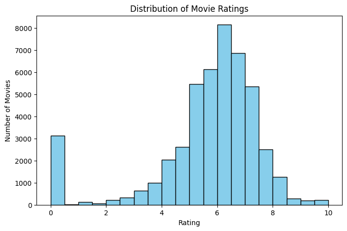
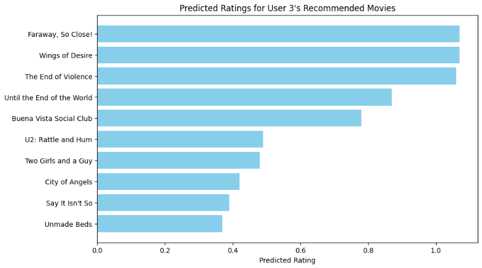

# movie-recommender-system-movielens
# Movie Recommendation System

A data-driven movie recommendation system built using the MovieLens dataset.

**Course:** Math 382 – Scientific Computing  
**Institution:** California State University, Northridge  
**Authors:** Aren Sepanian, Bryan Caraballo  

---

## Project Overview

This project implements a movie recommendation system using user ratings data from the MovieLens dataset. The goal is to analyze user preferences and generate personalized movie recommendations based on similarity measures and rating patterns.

---

## Dataset

The dataset used in this project is available on Kaggle:

https://www.kaggle.com/datasets/rounakbanik/the-movies-dataset/data

Due to size limitations, the dataset is not included in this repository.

---

## Methodology

- Data cleaning and preprocessing of movie metadata and ratings  
- Exploratory data analysis (EDA) using visualizations  
- Construction of a recommendation system using:
  - Similarity metrics  
  - User-item interactions  
- Evaluation of recommendation performance  

---

## Repository Contents

- `Collab/` — Google Collab containing full analysis and model  
- `data/` — placeholder for dataset (not included)  
- `outputs/` — visualizations and results  

---

## Results

The model can identify similar movies and generate recommendations based on user preferences and rating patterns.

---
## Visualizations

### Rating Distribution

Distribution of movie ratings across the dataset, showing concentration of ratings in the mid-to-high range.

---

### Sample Recommendations

Example of predicted ratings for a user, demonstrating the model’s ability to rank and recommend movies based on learned preferences.

---

## Tools & Technologies

- Python (Pandas, NumPy, Matplotlib, Scikit-learn)  
- Google Collab  

---

## Visualizations

### Rating Distribution

Distribution of movie ratings across the dataset, showing a concentration in the mid-to-high range.

---

### Sample Recommendations

Example of predicted ratings for a user, demonstrating the model’s ability to rank and recommend movies based on learned preferences.

## Future Work

- Improve recommendation accuracy using collaborative filtering  
- Implement matrix factorization techniques  
- Build a user interface for interactive recommendations  

---

## Authors

- **Aren Sepanian** — California State University, Northridge  
- **Bryan Caraballo** — California State University, Northridge 

## Acknowledgments

This project was completed as part of Math 382: Scientific Computing at California State University, Northridge.
